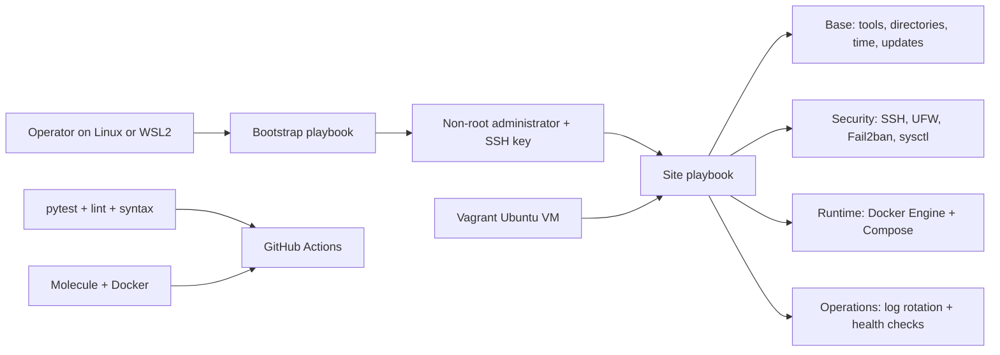

# Ubuntu Server Ansible

A production-style Ansible portfolio project for bootstrapping, hardening, and
operating fresh Ubuntu Server virtual machines. It creates a key-only capable
administrator account, applies conservative host security, installs Docker and
common operational tooling, and provides repeatable local and CI validation.

The project is designed for learning and demonstration, but its safety model is
deliberate: administrator access is bootstrapped and verified before SSH
hardening is applied.

## Architecture



The public entry points are:

- `playbooks/bootstrap.yml` — creates the administrator and installs public keys.
- `playbooks/site.yml` — applies all roles in a safe dependency order.
- `playbooks/verify.yml` — performs read-only service and configuration checks.

The roles manage administrator access, common tools, directories, time sync,
unattended security upgrades, safe sysctl values, Docker, Fail2ban, UFW,
logrotate, and OpenSSH hardening.

## Technology stack

- Ansible Core 2.17 with `ansible.posix` and `community.general`
- Ubuntu Server 22.04 and 24.04, x86_64 or ARM64
- OpenSSH, UFW, Fail2ban, systemd-timesyncd, unattended-upgrades
- Docker Engine, Buildx, and Docker Compose plugin from Docker's apt repository
- Molecule with Docker for integration and idempotence checks
- Vagrant with VirtualBox for a realistic Ubuntu VM demonstration
- pytest, yamllint, ansible-lint, Make, and GitHub Actions

Python and Ansible dependencies, collections, and the Vagrant box are version
pinned. The Molecule systemd test image is the notable exception because its
upstream publisher provides a moving `latest` tag; see the limitations section.

## Prerequisites

For static checks on Linux or WSL2:

- Python 3.10 or newer, `python3-venv`, `make`, and `git`
- outbound HTTPS for the first dependency installation

For the Docker test path:

- Docker Engine on Linux, or Docker Desktop with WSL2 integration on Windows
- permission to run privileged containers

For the VM demonstration:

- Vagrant 2.4 or newer and VirtualBox 7
- at least 2 GB free RAM and approximately 10 GB free disk space

All development and testing can remain local. No cloud account, paid service, or
public IP address is required.

## Installation

### Linux

```bash
sudo apt-get update
sudo apt-get install -y git make python3-venv
git clone REPLACE_WITH_REPOSITORY_URL
cd ubuntu-server-ansible
make setup
```

### Windows with WSL2

Install Ubuntu in WSL2, enable Docker Desktop's WSL integration if using
Molecule, then run inside the WSL distribution:

```bash
sudo apt-get update
sudo apt-get install -y git make python3-venv
cd /mnt/c/path/to/ubuntu-server-ansible
make setup
make test
```

Vagrant and VirtualBox should be installed on Windows. Run `vagrant up` from
PowerShell in the repository directory, or configure WSL to call the Windows
Vagrant executable. Molecule is usually the simpler WSL2 workflow.

## Production usage

### 1. Prepare inventory and Vault variables

Copy the example into the ignored production directory and replace documentation
addresses with your targets:

```bash
mkdir -p inventories/production/group_vars
cp inventories/example/hosts.yml inventories/production/hosts.yml
ansible-vault create inventories/production/group_vars/vault.yml
```

Put only public keys and other variables in the encrypted file. Keep the vault
password outside the repository. The complete safe workflow is documented in
`docs/explanations/vault.md`.

### 2. Bootstrap access

Cloud images commonly expose a temporary `ubuntu` user. Supply that initial user
without storing it in inventory:

```bash
ansible-playbook -i inventories/production/hosts.yml \
  -u ubuntu --ask-become-pass playbooks/bootstrap.yml \
  --ask-vault-pass
```

Open a second terminal and prove both key login and sudo work:

```bash
ssh portfolio_admin@SERVER_ADDRESS
sudo -n true
```

Do not continue until this succeeds. Keep the initial console or SSH session open.

### 3. Preview and apply configuration

```bash
ansible-playbook -i inventories/production/hosts.yml playbooks/site.yml \
  --check --diff --ask-vault-pass
ansible-playbook -i inventories/production/hosts.yml playbooks/site.yml \
  --ask-vault-pass
```

Password authentication is controlled by `ssh_password_authentication`. It
defaults to `false`; set it to `true` during a cautious first rollout if needed.
Root login defaults to key-only `prohibit-password`, providing a recovery path.
After console recovery and administrator access are proven, production inventory
may set `ssh_permit_root_login: "no"`.

Use tags for focused maintenance:

```bash
ansible-playbook -i inventories/production/hosts.yml playbooks/site.yml --tags docker
ansible-playbook -i inventories/production/hosts.yml playbooks/site.yml --tags ssh,firewall --check --diff
```

## Local demonstration

The Vagrant environment runs Ansible inside the guest, so the Windows host does
not need Ansible:

```bash
make up
make verify
make provision
make down
```

`make provision` is the visible second convergence used to discuss idempotence.
For the Docker path:

```bash
make setup
make molecule
```

See `DEMO.md` for an exact five-minute employer presentation.

## Verification commands

```bash
make lint
make test
make molecule
ansible-playbook -i inventories/production/hosts.yml playbooks/verify.yml
```

Useful target-side checks include:

```bash
sshd -t
sudo ufw status verbose
sudo fail2ban-client status sshd
docker version
docker compose version
timedatectl show-timesync --all
sudo unattended-upgrade --dry-run --debug
sudo logrotate --debug /etc/logrotate.d/managed-applications
```

## Idempotence

Tasks use declarative modules, deterministic templates, apt cache validity, and
change-triggered handlers. Molecule's `idempotence` stage converges the same
instance twice and fails on unexpected changes. On a VM, run `make provision`
twice and inspect the second play recap; package repository metadata can still
change independently of this project.

## Troubleshooting

- **Missing collection:** run `make setup` and confirm `collections_path` in
  `ansible.cfg` points to `.cache/ansible/collections`.
- **Host key verification failure:** verify the server fingerprint out of band,
  remove only the stale entry with `ssh-keygen -R SERVER_ADDRESS`, and reconnect.
  Do not globally disable host-key checking.
- **Docker apt failure:** confirm Ubuntu release support, DNS, clock accuracy, and
  HTTPS access to `download.docker.com`.
- **Molecule cannot start systemd:** confirm Docker allows privileged containers
  and cgroup v2 is mounted. Use Vagrant when the host policy forbids privilege.
- **Vagrant box or virtualization error:** confirm hardware virtualization is
  enabled and another hypervisor is not conflicting with VirtualBox.
- **SSH lockout:** keep the console session open and follow
  `docs/runbooks/ssh-recovery.md`.

## Security considerations

- UFW denies unsolicited inbound traffic and permits only declared ports.
- SSH passwords can be disabled; empty passwords and keyboard-interactive login
  are denied, and the configuration is validated before reload.
- Fail2ban rate-limits repeated SSH authentication failures through UFW.
- Security updates are installed automatically; automatic reboot is opt-in.
- Docker group membership is root-equivalent. Only the designated administrator
  is added, and application accounts should not join it.
- Sudo defaults to passwordless for automation on the administrator account. Set
  `admin_sudo_passwordless: false` when interactive password-backed sudo is
  operationally available.
- Safe sysctl settings avoid aggressive network tuning that could break routing
  or container workloads.
- Ansible Vault protects stored variables, but runtime output, backups, and the
  vault password still require separate controls.

## Limitations

- Ubuntu derivatives and non-Ubuntu distributions are intentionally rejected.
- The project does not manage cloud networking, DNS, TLS certificates, backups,
  applications, monitoring agents, or secret rotation.
- UFW and Docker both manipulate netfilter; published container ports require a
  separate, environment-specific policy review.
- Adding a user to the Docker group grants root-equivalent host control.
- The Molecule image uses an upstream moving `latest` tag because no immutable
  version is published; the Vagrant box and Python dependencies are pinned.
- Container tests approximate systemd Ubuntu but cannot replace a VM or staging
  environment for kernel, networking, reboot, and SSH reachability behavior.
- Automatic security updates can introduce change outside an Ansible run; use a
  staged update strategy for strict production change windows.

## Future improvements

- Pin the Molecule image by digest and automate dependency updates.
- Add Ubuntu 26.04 testing after it reaches a stable support baseline.
- Add nftables-aware Docker ingress policy tests.
- Add backup jobs, restore tests, node metrics, auditd, and centralized logs.
- Add cloud-specific ephemeral integration tests and OpenSCAP reporting.
- Sign commits and release artifacts and generate a software bill of materials.

## Interview talking points

- Why bootstrap and hardening are separate failure domains.
- How handlers, templates, defaults, tags, and check mode support safe operations.
- Why idempotence is tested with a second convergence rather than merely claimed.
- The trade-off between fast privileged-container tests and realistic VM tests.
- Why Docker group membership is a conscious least-privilege exception.
- How RFC 5737 example addresses, Vault guidance, and ignored production inventory
  prevent accidental disclosure.
- How serial rollout and a console-backed SSH recovery runbook reduce blast radius.

More detailed questions and model answers are in `INTERVIEW.md`.

## License

MIT. See `LICENSE`.
